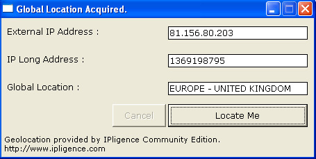



## GeoLocator

### Description

Get your geographical location without the use of the registry and system settings. This is a component of my Global Assistant App which is being designed not to use system settings, as we all know people can get stuff up wrong when setting up Windows. Displays use of IP To location database and the conversion of a Dot IP to Long IP based on ISO3166. The acquasition of the external IP isn't tested on proxys (It would be good to know if it is still effective)
 
### More Info
 

             |
---                |---
**Submitted On**   |2006-12-05 07:22:08
**By**             |[Steven Atkiss](https://github.com/Planet-Source-Code/PSCIndex/blob/master/ByAuthor/steven-atkiss.md)
**Level**          |Intermediate
**User Rating**    |5.0 (10 globes from 2 users)
**Compatibility**  |VB 5\.0, VB 6\.0
**Category**       |[Miscellaneous](https://github.com/Planet-Source-Code/PSCIndex/blob/master/ByCategory/miscellaneous__1-1.md)
**World**          |[Visual Basic](https://github.com/Planet-Source-Code/PSCIndex/blob/master/ByWorld/visual-basic.md)
**Archive File**   |[GeoLocator2035611252006\.zip](https://github.com/Planet-Source-Code/steven-atkiss-geolocator__1-67296/archive/master.zip)

